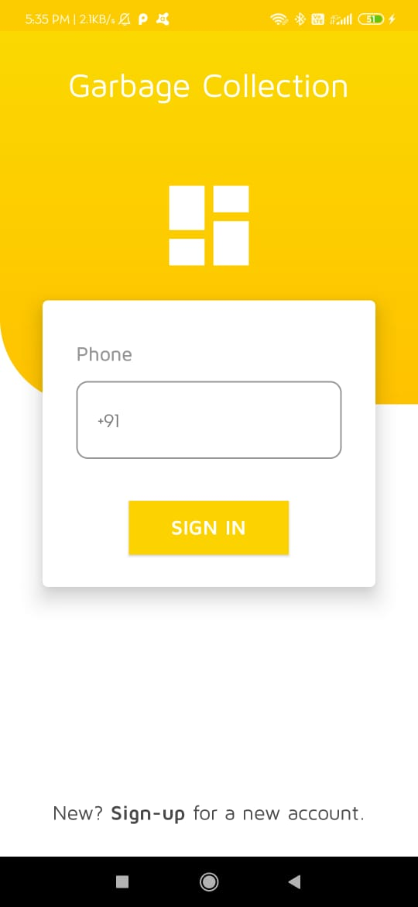
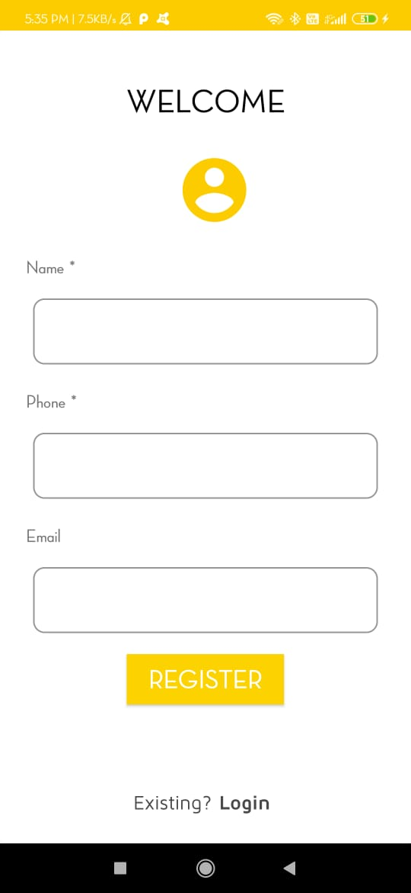
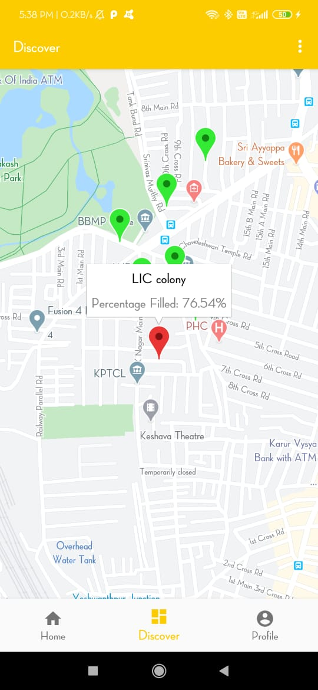
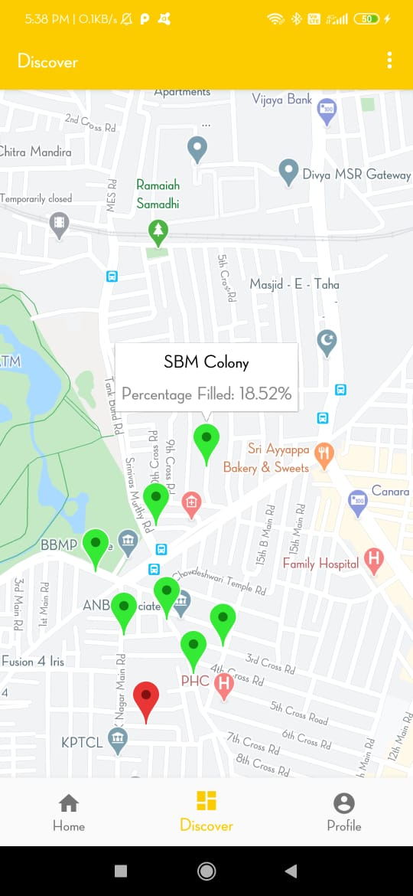

# ProjectGC - Garabage Collection Prototype
This prototype is useful for storing the respective drivers of their areas and storing the location of garbage cans location's in **Cloud Firestore**.

   

  

  

